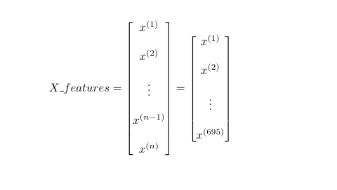
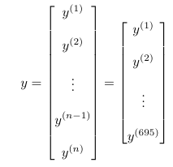
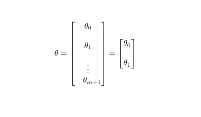

This project is about learning the mathematics and statistics behind linear regression. To make it more challenging I extended this idea of regression to N dimensions using matrices. Before we begin I encourage you as the reader to have some understanding of what vectors, differentition, and matrices are, as it will help you in understanding the theory and formulas given below.

The dataset we are working with is of the name "l1_test.csv" and "l1_train.csv" which can be found in the dataset folder in my Github repository. The dataset contain two types of variables: 

>**Independent variable** (also known as predictor, regressor or input) : a variable chosen by the designer which can be adjusted to represent any value, typically placed on the X-axis \
>
>**Dependent variable** (also known as response) : the value of this variable changes depending on the value of the predictor(s), this is what we measure as a result of changing the independent variable

# Understanding the dataset
Before we begin it is useful and necessary to understand the dataset you are working with. As a result of this we introduce two new variables which will be important in the code:

>
>**n** : number of samples (observations or data points)
>
>**m** : number of predictors (independent variables)

If we take a look at the dataset for our training set we note the following: \
$n =  696 - 1 = 695$ (we decrease by one to not account for the header label) \
$m = 2 - 1 = 1$ (there is only one dependent variable, y) 

I encourage you as the reader to calculate the respective size (m and n) for the testing set for some practice.

# Extracting data from CSV file
Now that we know the number of independent variables, we can use the variable **m** to extract data from the CSV file into a numpy array. 
Why do we use Numpy arrays? Simply because we can do operations on multiple elements at once (using matrices) instead of doing it one element at a time. This allows for more efficient computation and parallelization. 
To extract data from CSV file we use a Python library called "Pandas". This library provides a function called `read_csv(...)` which takes the file location as an argument. 
Pairing this function with the `to_numpy()` function allows us to put the data into numpy arrays, see code below.

```
training_set = pd.read_csv('./dataset/l1_train.csv').to_numpy()
testing_set = pd.read_csv('./dataset/l1_test.csv').to_numpy()
```
**NB!** Note the location where you may store the CSV files can be different, in that case just replace the location in the `read_csv(...)` with your respective path.

# Creating the model structure
**NB!** I assume you have some grasp of classes in Python, thus I will not elaborate on this syntax.
To make the coding experience easier I make use of Python classes. Our constructor takes in two arguments, **epochs** and **learning_rate $\alpha$**. The cost history field is used to keep track of the loss value during each epoch.

> **Epoch**: the number of iterations in our training loop 
> 
> **Training loop**: the learning process in which the model adjusts its weights (in our case $\theta$) to better map predictors to actual responses 
>
> **Learning rate $\alpha$**: a number that influences how much the model tweaks itself in each epoch (more on this later)

```
def __init__(self, epochs: int, learning_rate: int):
        self.epochs = epochs
        self.learning_rate = learning_rate
        self.theta= None
        self.cost_history = [] # Keep track of the distance score
```

The next question is what is needed for creating a linear regression model? \
1. `fit(self, X_features, y)`: the main function of our model, estimates the weights of our network given the training dataset \
2. `standardize(self, X)`: standardizes the data, by subtracting the mean and dividing by the standard deviation \
3. `predict(self, X)`: computes an estimated response given the features design matrix X, and model weights $\theta$ \
4. `cost_function(self, X,y)`: computes the distance score using mean squared error (MSE), we append this loss value to our `cost_history` array \
5. `gradient(self, X, y, n)`: computes the gradient of the given cost function \
6. `r_square(self, X, y)`: computes the coefficient of determination, useful for metric for understanding how well the model performs \

Do not worry if you do not understand everything yet, we will go through each component of the list. 

## Fitting the data
As described briefly earlier, we use the `fit(self, X_features: np.ndarray, y: np.ndarray)` function as our main method of running the model. We will now make use of **n** and **m** which we found earlier.
> **X_features**: a matrix of shape $n \times m$, represents all of our samples (i.e. the values of our predictors)
> 
> **y**: a vector of shape $n \times 1$, representings the actual responses (the values of the dependent variable)

Mathematically we can represent these matrices as the following: \
   \

The exponent of each element does **not denote x raised to some power i**, but represents all the values of the predictors at a specific row. These values are represented as a some collection (like an array or tuple). For the training dataset we have: \
$x^{(1)} = [24]$ and $y^{(1)} = [21.54945196]$ \
$x^{(2)} = [50]$ and $y^{(2)} = [47.46446305]$ \
$x^{(4)} = [38]$ and $y^{(4)} = [36.58639803]$ 

Try understand why this is the case, as this will help in understanding the equations that come later for **hypothesis function $h_{\theta}(x)$** and **gradient vector $\del_{\theta}J(\theta)$**
