This project is about learning the mathematics and statistics behind linear regression. To make it more challenging I extended this idea of regression to N dimensions using matrices. Before we begin I encourage you as the reader to have some understanding of what vectors, differentition, and matrices are, as it will help you in understanding the theory and formulas given below.

The dataset we are working with is of the name "l1_test.csv" and "l1_train.csv" which can be found in the dataset folder in my Github repository. The dataset contain two types of variables: 

>**Independent variable** (also known as predictor, regressor or input) : a variable chosen by the designer which can be adjusted to represent any value, typically placed on the X-axis \
>
>**Dependent variable** (also known as response) : the value of this variable changes depending on the value of the predictor(s), this is what we measure as a result of changing the independent variable

# Understanding the dataset
Before we begin it is useful and necessary to understand the dataset you are working with. As a result of this we introduce two new variables which will be important in the code:

>
>**n** : number of samples (observations or data points)
>
>**m** : number of predictors (independent variables)

If we take a look at the dataset for our training set we note the following: \
$n =  696 - 1 = 695 \quad$ (we decrease by one to not account for the header label) \
$m = 2 - 1 = 1 \quad$ (there is only one dependent variable, y) 

I encourage you as the reader to calculate the respective size (m and n) for the testing set for some practice.

To find **n** and **m** in Python we utilize the shape attribute of a numpy array (which is a np.ndarray object). In the example under we use a matrix `X_features`, which represents the values of the predictors in the training dataset. 
```
n = X_features.shape[0] # Number of samples
m = X_features.shape[1] # Number of predictors (features)
```
The shape of X_features is $(695, 1)$, and can be computed using:
```
X_features_shape = X_features.shape
```


# Extracting data from CSV file
Now that we know the number of independent variables, we can use the variable **m** to extract data from the CSV file into a numpy array. 
Why do we use Numpy arrays? Simply because we can do operations on multiple elements at once (using matrices) instead of doing it one element at a time. This allows for more efficient computation and parallelization. 
To extract data from CSV file we use a Python library called "Pandas". This library provides a function called `read_csv(...)` which takes the file location as an argument. 
Pairing this function with the `to_numpy()` function allows us to put the data into numpy arrays, see code below.

```
training_set = pd.read_csv('./dataset/l1_train.csv').to_numpy()
testing_set = pd.read_csv('./dataset/l1_test.csv').to_numpy()
```
> [!IMPORTANT]
> **NB!** Note the location where you may store the CSV files can be different, in that case just replace the location in the `read_csv(...)` with your respective path.

# Creating the model structure
> [!IMPORTANT]
> I assume you have some grasp of classes in Python, thus I will not elaborate on this syntax.

To make the coding experience easier I make use of Python classes. Our constructor takes in two arguments, **epochs** and **learning_rate $\alpha$**. The cost history field is used to keep track of the loss value during each epoch.

> **Epoch**: the number of iterations in our training loop 
> 
> **Training loop**: the learning process in which the model adjusts its weights (in our case $\theta$) to better map predictors to actual responses 
>
> **Learning rate $\alpha$**: a number that influences how much the model tweaks itself in each epoch (more on this later)

In Python code:
```
def __init__(self, epochs: int, learning_rate: int):
        self.epochs = epochs
        self.learning_rate = learning_rate
        self.theta= None
        self.cost_history = [] # Keep track of the distance score
```

The next question is what is needed for creating a linear regression model? 
1. `fit(self, X_features, y)`: the main function of our model, estimates the weights of our network given the training dataset 
2. `standardize(self, X)`: standardizes the data, by subtracting the mean and dividing by the standard deviation 
3. `predict(self, X)`: computes an estimated response given the features design matrix X, and model weights $\theta$ 
4. `cost_function(self, X,y)`: computes the distance score using mean squared error (MSE), we append this loss value to our `cost_history` array 
5. `gradient(self, X, y, n)`: computes the gradient of the given cost function 

Do not worry if you do not understand everything yet, we will go through each component of the list. 

## Fitting the data
As described briefly earlier, we use the `fit(self, X_features: np.ndarray, y: np.ndarray)` function as our main method of running the model. We will now make use of **n** and **m** which we found earlier.
> **X_features**: a matrix of shape $n \times m$, represents all of our samples (i.e. the values of our predictors)
> 
> **y**: a vector of shape $n \times 1$, representings the actual responses (the values of the dependent variable)

Mathematically we can represent these matrices as the following: 

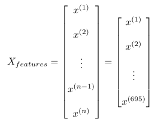

 

The exponent of each element does **not denote x raised to some power i**, but represents all the values of the predictors for a specific sample in the dataset (in our case the training set). These values are represented as 1D numpy array. For the training dataset we have: \
$x^{(1)} = [24] \quad$ and $\quad y^{(1)} = [21.54945196]$ \
$x^{(2)} = [50] \quad$ and $\quad y^{(2)} = [47.46446305]$ \
$x^{(4)} = [38] \quad$ and $\quad y^{(4)} = [36.58639803]$ 

### Example dataset
Let us do an example with more than one predictor to become more comfortable with this notation $x^{(i)}$. In this scenario we are going to use a dataset with three predictors, and one dependent variable. 

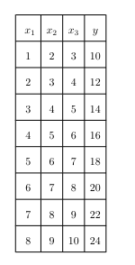 

The following matrices for the features (predictors), actual responses and weights ($\theta$):

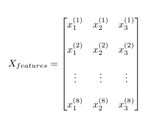 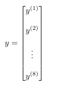 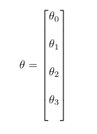

> [!NOTE]
> Notice how the weight matrix always has one more element than the predictor matrix $X_{features}$? \
> This is why the shape of the matrix $\theta$ is $(m+1, 1)$

$x^{(1)} = [1, 2, 3] \quad$ and $\quad y^{(1)} = [10]$ \
$x^{(2)} = [2, 3, 4] \quad$ and $\quad y^{(2)} = [12]$ \
$x^{(4)} = [4, 5, 6] \quad$ and $\quad y^{(4)} = [16]$ 

> [!TIP]
> Try understand why this is the case, as this will help in understanding the equations that come later (e.g. **hypothesis function $h_{\theta}(x)$** and **gradient vector $\nabla_{\theta}J(\theta)$**)

The `fit` function expects two arguments, the feature matrix and the actual response matrix. To fetch these, we use slicing.
```
model = LinReg(epochs=10000, learning_rate=0.001)
model.fit(X_features=training_set[:,:m], y=training_set[:,m:])
```
It is important than the variable **m** is included in the slicing, because if it is omitted the resulting slicing operation will not be of the correct shape expected by the `fit` function. \
For now we set the **epochs** and **learning rate $\alpha$** to 10 000 and 0.001 respectively. The exact reason for the choice of values will be explained shortly.

Before we can build the training loop, two additional steps need to be done first. First we need to intialize the weight matrix, as it is used to estimate responses. We will choose to use random initialization using a normal distribution, as it provides faster convergence compared to intializing all weights to 0. See code below.
```
self.theta = np.random.normal(scale=0.01, size=(m+1, 1))
```
For the second part, we choose to do standardization.

## Standardization of the features/predictors
> [!IMPORTANT]
> I assume you as the reader have some knowledge on statistics, specifically what the mean and standard deviation represents and also what a statistical distribution is.

Standardization is an important part of this algorithm, as we are able to reduce the time needed to converge towards minimum of the loss function.
Essentially you are transforming the features such that they have a mean of 0, and a standard deviation of 1. **This is very useful in the training loop**. See code below.
```
X_features = self.standardize(X_features)
```
Using one of the methods defined on the class:
```
 def standardize(self, X: np.ndarray) -> np.ndarray:
        mean = np.mean(X, axis=0)
        std = np.std(X, axis=0)
        X = (X - mean) / std
        return X
```

## Predicting values and design matrix
At this stage we are ready to start predicting values using the weights of our model, and the samples representing the features $\textemdash$ i.e. the features matrix.
To estimate responses we use a **hypothesis function $h_{\theta}(x)$, also called a regression function. The generalized regression function takes in single predictor, thus a 1D numpy array of some length m (m independent variables). 
$h_{\theta}(x) = \theta_{0} + \theta_{1} \cdot x_{1} + \dots + \theta_{n-1} \cdot x_{n-1} + \theta_{n} \cdot x_{n}$

We introduce a new matrix $\textemdash$ called **design matrix $X$** $\textemdash$ to simply the equation above. The design matrix has the following form:

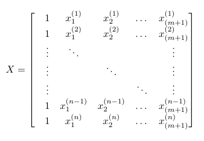 

Adjusting the matrix to our given dataset we get the following 

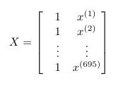

> [!NOTE]
> Notice that we have an additional column in the design matrix as opposed to the features matrix, and this difference plays an important role in simplifying the equation for the hypothesis function $h_{\theta}(x)$

We can now represent the hypothesis function **$h_{\theta}(x)$** as a matrix product between the design matrix $X$ and the weight matrix $\theta$!
$$h_{\theta}(x) = \theta_{0} + \theta_{1} \cdot x_{1} + \dots + \theta_{n-1} \cdot x_{n-1} + \theta_{n} \cdot x_{n} \equiv X \cdot \theta$$

To verify this, we can check the shape of both matrices: 
* Design matrix $X$ has a shape of $(n, m+1)$ which translates to (695, 2) in our training set 
* Weight matrix $\theta$ has a shape of $(m+1, 1)$ which translates to (2, 1) in our training set
  
**Check matrix multiplication**: $X \cdot \theta = (695,2) \times (2,1) = (695,1)$ ✅ 

Since the two inner terms of the multiplication is equal, the matrix multiplication is successful. Here is how you can implement the formula for the hypothesis function $h_{\theta}(x)$
```
 def predict(self, X: np.ndarray) -> np.ndarray:
        y_est = np.dot(X, self.theta)
        return y_est
```

> [!TIP]
> As a question for the reader, what would happen if the multiplication was in the reverse order, that is $\theta \cdot X$?

## Cost function and cost history
Now that we have a way to estimate responses using our weights and features, we want to measure how well our model is doing. Upon each epoch, we calculate the gradient of the given cost function, where the weight matrix $\theta$ is changed slightly in each iteration. The cost function we will be using is based on the mean squared error, which is a popular choice for linear regression. The general formula for MSE is given by

$$MSE = \frac{1}{n} \cdot \sum_{i=1}^{n} (\hat{Y_{i}} - Y_{i} )^{2}$$
> [!NOTE]
> You may wonder where the "error" part of the MSE name comes from. The error (also known as **residual**), e, is the difference between the predicted response and the actual response, i.e.
> $$e = \hat{Y_{i}} - Y_{i}$$

> **n** : number of samples
> 
> **$\hat{Y_{i}}$**: the estimated response for a given sample (indicated by i)
> 
> **$Y_{i}$**: the actual response for a given sample (indicated by i)

We can optimize this equation for matrices by using what we derived for the hypothesis function $h_{\theta}(x)$. We will follow the convention and call the cost function $J(\theta)$, thus
$$MSE = J(\theta) = \frac{1}{n} \cdot \bigr[(X\theta - y)^{T} \cdot (X\theta - y)\bigr]$$

> [!NOTE]
> Whenever you take the dot product between two vectors, the result is a scalar. This also applies to matrix multiplication of two matrices, where one matrix is the transpose of the other.
> The reason for this behaviour is due to **duality** between dot product and matrix multiplication. Thus the result of this matrix multiplication is a **scalar** not a matrix!

The following code illustrates how this can be implemented in Python. 
```
def cost_function(self, X: np.ndarray, y: np.ndarray) -> float:
        n = len(y) 
        y_est = self.predict(X)
        e = y_est - y 
        J = 1/(2*n) * np.dot(e.T, e).item() # Translate 1x1 matrix into a scalar
        return J
```

The **cost_history** is a list of the loss score for each respective epoch. It is not necessary to include it, but it provides insight into whether the gradient descent is implemented correctly or not. If implemented correctly the loss value should decrease in each epoch, which we choose to display in a graph at the end. For this reason the process of updating the list must happen within the **training loop** (covered breifly in the next section).
```
self.cost_history.append(self.cost_function(X, y))
```


## Gradient descent and learning rate $\alpha$
This is the core of learning in machine learning.
> **Gradient descent**: an algorithm that uses the gradient of the loss function, to find the minimum of the loss function

So how do we get to this minimum, how does it look like?
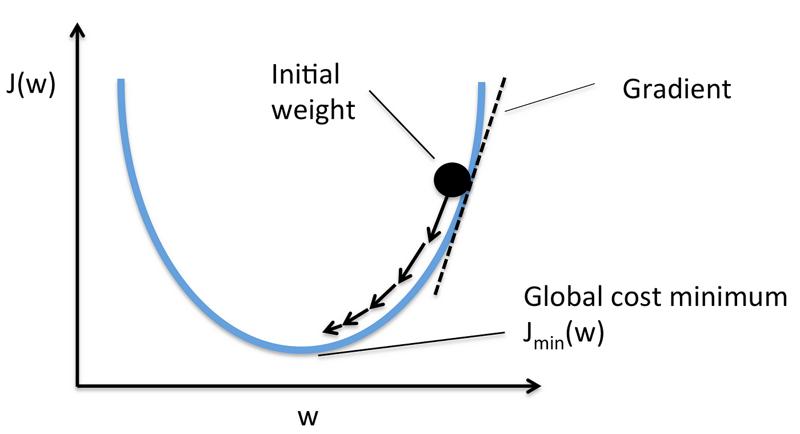

Think of the gradient as a ball. The random intialization can be thought of as a person holding the ball in some random location on the graph, which in this case is one dimensional (1D).
If the person were to let go of the ball, the ball would roll down to until it stops, which can be local minimum or global minimum. 

In more technical terms, the ball can be seen as weights of the network, and we use the gradient $\textemdash$ which tells us the direction of steepest descent **in the current position** $\textemdash$ to move in the 
direction which leads us to a minimum of the loss function. The arrows on the image represents the location of the ball at each epoch, which is controlled by the **learning rate $\alpha$**. So in each **epoch** the ball recieves a new position, i.e. the weights' values are slightly modified. The ideal situation is to end up in a global minimum (indicated by the picture), not a local minimum.

To calculate the gradient of the loss function we must find the partial derivatives with respect to each weight $\theta_{i}$, where i $\in \mathbb{R}$.
Using vector and matrix calculus we find that the gradient of the hypothesis function $J(\theta)$ is given by:
$$\frac{\partial J(\theta)}{\partial \theta} = \frac{1}{n} \cdot \bigr[X^{T} \cdot (X \cdot \theta - y) \bigr]$$

In Python
```
 def gradient (self, X: np.ndarray, y: np.ndarray, n: int) -> np.ndarray:
        y_est = self.predict(X)
        e = y_est - y # Error vector
        g = (1/n) * np.dot(X.T, e)
        return g
```

This `gradient`function will return a matrix of shape $(2, 1)$ in our example, since we have only two weights (m+1). This result is used in the **training loop** which is located in our `fit`function. 
```
for _ in range(self.epochs):
        step =  self.learning_rate * self.gradient(X, y, n)
        self.theta = self.theta - step
```

# Plotting and final results
To visualize our results I chose to use Matplotlib. The following code sample plots the cost history up to the epochs:
```
  plt.figure()
    plt.plot(np.arange(1, model.epochs + 1), model.cost_history, 'r', label='Cost history')
    plt.xlabel('Epochs')
    plt.ylabel('Cost')
    plt.legend()
    plt.grid()
    plt.savefig('cost_history.png')
```

To plot the linear regression line up against the actual responses we need to acquire the linear regression equation:
```
predicted_response = np.dot(model.standardize(testing_set[:,:m]), model.theta[1:]) + model.theta[0]
```
Now we can plot the linear regression line and the actual responses using a scatter plot. 
>[!NOTE]
> The data we are using is 1D, since we have one predictor only. For higher dimensional data plotting becomes harder, therefore you could rather use coefficients to check the model's performance, like coefficient of determination.

```
 plt.figure()
    plt.scatter(testing_set[:,:m], testing_set[:,m:], label='True response', color='blue')
    plt.plot(testing_set[:,:m], predicted_response, label='Predicted response', color='red')
    plt.title('Linear Regression')
    plt.xlabel('Predictor (X)')
    plt.ylabel('Response (y)')
    plt.legend()
    plt.savefig('prediction.png')
```
These are the following outputs I got from compiling the model on two computers A and B. Computer B is quite old (comapred to computer A), and you can see that the model performance is a lot worse!

**Results from running model on computer A:** \
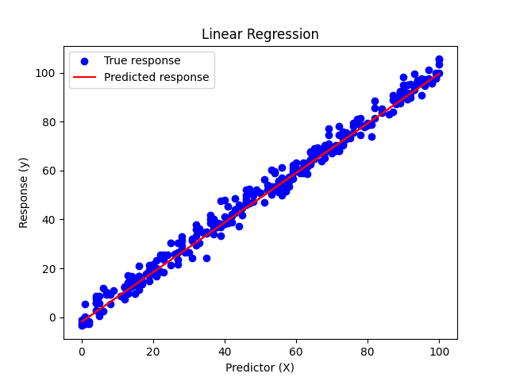 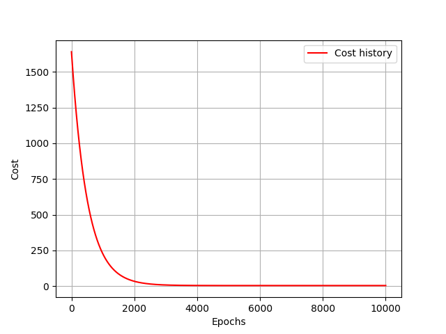 

\
\
**Results from running model on computer B:** \
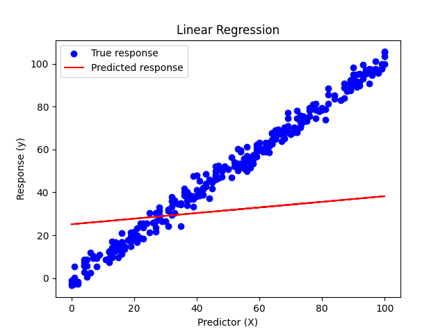 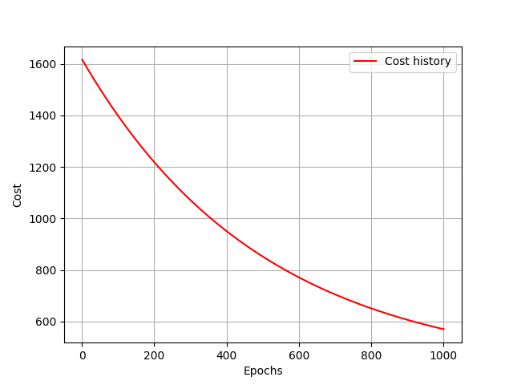


## Comparing with Sklearn and using $R^{2}$
To check if our model is doing well, we will compare it with Sklearn's implementation of linear regression, and our calculated coefficient of determination $R^{2}$.
```
model_r2 = model.r_square(testing_set[:,:m], testing_set[:,m:])
print("Custom model R^2: ", model_r2)
    
# Compare with sklearn implementation
reg = LinearRegression().fit(training_set[:,:m], training_set[:,m:])
r_2_sklearn = reg.score(testing_set[:,:m], testing_set[:,m:])
print("Sklearn model R^2: ", r_2_sklearn)
```
To calculate the coefficient of determination $R^{2}$ we use equations involving matrices. 

$$SS_{res} = (y - \hat{y})^{T} \cdot (y - \hat{y})$$ 

$$SS_{tot} = (y - \overline{y})^{T} \cdot (y - \overline{y})$$ 

$$R^{2} = 1 - \frac{SS_{res}}{SS_{tot}}$$ 

$$\overline{y} = \frac{1}{n} \cdot \sum_{n=1}^{n} y_{i}$$ 

> y: the response matrix, shape $(n,1)$
> 
> $\hat{y}$: matrix representing the estimated response, shape $(n,1)$
> 
> $\overline{y}$: matrix representing the mean, shape $(n,1)$
> 
> n: the number of **actual response samples**

You can find $\overline{y}$ by using the following code:
```
y_bar = np.mean(y)
```

In code this done by calling the `r_square` function:
```
def r_square(self, X: np.ndarray, y: np.ndarray) -> float:
        X = self.standardize(X)
        y_est = self.predict(np.c_[np.ones(X.shape[0]), X])
        e = y - y_est
        # Residual sum of squares (SS_res)
        SS_res = np.dot(e.T, e).item() 
        
        y_bar = np.mean(y)
        s = y - y_bar
        # Total sum of squares (SS_tot)
        SS_tot = np.dot(s.T, s).item()
        
        r_2 = 1 - SS_res/SS_tot
        return r_2
```
Running this function we can compare it to sklearn giving us
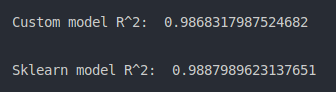


