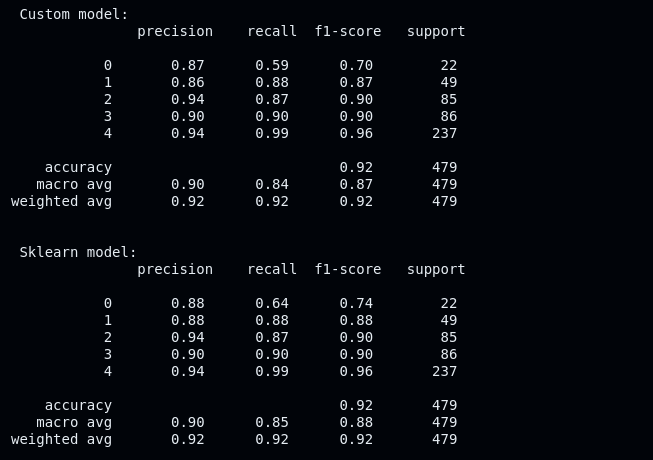
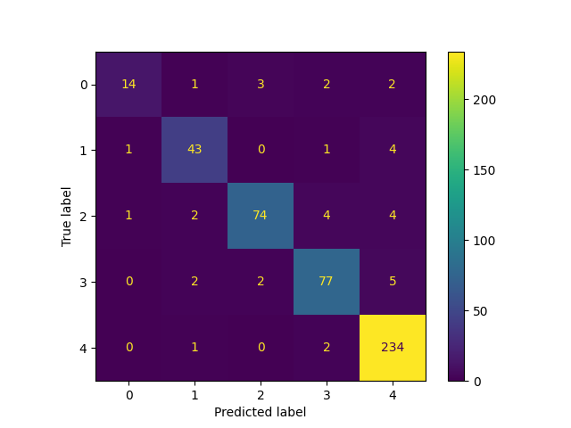

**DATASET FROM**: https://www.kaggle.com/datasets/rabieelkharoua/students-performance-dataset/data

&nbsp;

# The structure of the dataset
This dataset has multiple classes, thus we are dealing with **multiclass classification**. 
> **StudentID**, type=int, predictor variable
>
> **Age**, type=int, predictor variable
>
> **Gender**, type=int, predictor variable
>
> **Ethnicity**, type=int, predictor variable
>
> **ParentalEducation**, type=int, predictor variable
>
> **StudyTimeWeekly**. type=float, predictor variable
>
> **Absences**, type=int, predictor variable
>
> **Tutoring**, type=int, predictor variable
>
> **ParentalSupport**, type=int, predictor variable
>
> **Extracurricular**, type=int, predictor variable
>
> **Sports**, type=int, predictor variable
>
> **Music**, type=int, predictor variable
>
> **Volunterring**, type=int, predictor variable
>
> **GPA**, type=float, predictor variable
>
> **GradeClass**, type=int, **response variable**

If you inspect the dataset, you will notice that encoding is already applied on the categorical features. Thus there are less preprocessing steps needed before we can train the model.

&nbsp;

# Decision Stump
A decision stump is in simple terms a decision tree which consists of a root node, and two leaf nodes. In other words, you only need to determine the best feature once, then split the data according to this feature and its corresponding threshold.
Adaboost typically uses decision stumps &emdash; unlike GradientBoosting which uses decision trees with greater depths &emdash; as weak learners. Here are some reasons as to why.

* Weak learners should perform slightly better than random guessing, which decision stumps satisfy
* Decision trees with great depths are more prone to overfitting, which is not the case for decision stumps
* Decision stumps can be trained very quickly

&nbsp;

# Information gain and entropy
To find the best feature to split on when training a decision tree, you can choose between various metrics such as **Gini impurity** or **Information gain**. Do note that there exists many other techniques, the ones mentioned are only but a few.
In this project we will be using **information gain**, which uses a concept called **entropy**. Information gain, like Gini impurity, tells us how important a given feature is. However unlike Gini impurity &emdash; in which lower scores is better &emdash; features with larger corresponding information gain are better. 

$$\text{Entropy, e} = \quad - \sum_{i=1}^{n} p_i \log_{2}(p_i)$$

Information gain is given by the following equation

$$\text{IG}(T, a) = \quad H(T) - H(T|A)$$

The equation can be interpreted as the difference between the entropy of the parent, $H(T)$, and the total entropy in the left and right leaf nodes respectively, $H(T|A)$. This is the generalized form of information gain, but in Adaboost this form has to be modified to account for **weighted sampling**. 

## Entropy for multiclass
Due to using weighted sampling, we make use of the concept **scores** to help compute entropy. The `confidence_score()` function computes the score of a given class, which is the summed weights $w_i$ of the given class `i`, divided by the total weight for all classes. See below.

```
def confidence_score(self, y, w):
    w_total = np.sum(w)
    w_class = np.array([np.sum(w[y==c]) for c in self.n_classes])
    conf_score = w_class / (w_total+1e-10)     
    return conf_score
```
The small value (1e-10) in the total weight is used to prevent division by zero, which is possible if the current weak learner fits the data really well.


# Weighted error rate
The error, $\text{err}^{(m)}$, is a float value that describes the proportion of misclassifications against the total number of classifications. The `m` variable indicates the current m-th weak learner that is trained. Error is an important aspect of Adaboosting, as it is used to train a new weak learner which tries to minimize the error of the previous model. The error is given by:

$$\frac{\sum_{i=1} w_i \cdot I(y_i \neq T^{(m)}(x_i))}{\sum_{i=1}w_i}, \quad \forall i=1, \dots, n$$

However, in practice we generalize this to matrices. Thus we get the following:

$$\text{err}^{(m)} = \frac{w \cdot I(y \neq T^{(m)}(x))}{\sum_{i=1} w_i}, \quad \forall i=1, \dots, n$$

This equation may look very complex, but is more easily understood once broken down into parts.
> $I\left(\dots\\right)$ or $1\left(\dots\right)$, is called an **indicator function**, it returns 1 when the condition is satisfied, and 0 otherwise
>
> $y \neq T^{(m)}(x)$, is a condition that checks whether the y-label and the corresponding prediction $T^{(m)}(x)$ is equal or not
>
> $w$ is the weight matrix, with a shape of $\left(n,\right)$. Where `n` is the number of samples
>
> $y$ is the matrix containing the labels (responses), with a shape of $\left(n,\right)$. Where `n` is the number of samples

>[!NOTE]
> Why do we divide by the sum of the weights, $\sum_{i=1} w_i$?
>The reason is to ensure the error is between 0 and 1, which is really useful when calculating $\alpha^{(m)}$ (more on this soon). It also makes sense intuitively, as the weighted error is known as the **weighted average**.

# Importance weight
The importance weight denoted by $\alpha^{(m)}$, represents the amount of "say" a weak learner has in the final prediction. For example, a child is more likely to listen to their parents (indicated by a higher $\alpha$), than listening to his/her sibilings (indicated by a lower $\alpha$). The importance weight is computed slightly differently in a multiclass classification problem, see below.

$$\alpha^{(m)} = \log\left(\frac{1 - \text{err}^{(m)}}{\text{err}^{(m)}}\right) + \log\left(K-1\right)$$

Let us address each part of the equation. The first part,

$$\log\left(\frac{1 - \text{err}^{(m)}}{\text{err}^{(m)}}\right)$$

is the ratio of the correct and incorrect predictions. When the current weak learner performs better than random guessing, the **log-value is positive**. In a similar way, when the weak learner is no better than random guessing, the **log-value is negative**. \

What we want is for the error, $err^{(m)}$, to be less than 0.5 (0.5 representing random guessing). If the error of the current weak learner is greater than this threshold, its importance (i.e. $\alpha$ value) should naturally be lower. The second part of the equation is a part of what makes **Adaboost SAMME** different from regular Adaboost (used for binary classification). 

$$\log\left(K - 1\right)$$

When $K = 2$ (indicating two classes, thus binary classification), this term cancels out. When $K > 2$ we have multiclass scenario, and in such a case we need to use the second term $\log\left(K - 1\right)$ to ensure that the **alpha value is positive**. Otherwise the importance weight will be negative, which does not make sense. 

# Adaboost in simple steps
1. Initialize the weights, $w$, as $w = \frac{1}{n}$ \
Where `n` is the number of samples in the dataset.
2. Train a decision stump on the given features matrix, $X$, the labels $y$, and the **current** weights $w$
3. In the decision stump we need to find the best feature to split on, by considering the information gain from each possible feature. We also need to account for the weights which are associated with each sample
4. Store the fitted estimator in a list `estimators`, which will be used when making predictions
```
estimator = DecisionStump()
estimator.fit(X_train, y_train, w)
self.estimators.append(estimator)
```
5. Make predictions, which is represented by $T^{(m)}(x)$
```
y_pred = np.argmax(estimator.predict(X_train), axis=1) # Majority voting
```
6. Compute the error, $err^{(m)}$ for the given m-th classifier
```
err = self.weighted_error(y_train, y_pred, w)
```
8. Compute the importance weight, $\alpha^{(m)}$
```
K = len(estimator.n_classes)
alpha = np.log((1-err) / err) + np.log(K - 1)
```
10. Store this alpha value in a list `learning_rate`, which will be used when making predictions
11. Check that $\alpha > 0$, and that error $< 1 - \frac{1}{K}$
12. Update the weights using the following equation

$$w \leftarrow w \cdot exp\left[\alpha^{m} \cdot I\left(y_i \neq T^{(m)}(x)\right) \right] \quad \forall i = 1, 2, \dots, n$$

Which in code is implemented as:
```
w = w * np.exp(alpha * (y_train != y_pred))
```
13. Re-normalize the weights, so that they sum up to 1
```
w = w / np.sum(w) # Re-normalize
```
14. Repeat steps 2-13 until you have trained **n** number of weak learners (defined by the `n_estimators` attribute of the Adaboost object)
15. Make predictions! This is where we use the lists `estimators` and `learning_rate`. Defined by the equation:
$$C(x) = argmax_{k} \sum_{m=1} \alpha^{(m)} I\left(T^{(m)}(x) = k\right) \quad \forall m = 1, \dots, M$$

In code:
```
def predict(self, X_test):
        predictions = np.sum([e.learning_rate * e.predict(X_test) for e in self.estimators], axis=0)
        return np.argmax(predictions, axis=1)
```
# Results
I use the `classification_report()` function and `confusion_matrix()` function from Sklearn to understand the performance of both models (custom and Sklearn's implementation). The classification report is quite useful, as it provides the main classification metrics like precision, recall, f1-score, and more. The confusion matrix is a square matrix of shape $\left(K, K\right)$, where `K` is the number of classes we are trying to predict. In this project the confusion matrix is of size $5 \times 5$. The ROC-curve turns out to be quite complex for multiclass classification, as you cannot create a curve for all classes at once. A common approach to solve this issue is to create a ROC-curve for each class, however I chose to drop this metric for the given project. Below you can find the results from running both functions. 

**Results from classification report** \


**Confusion matrix for custom model** \


**Confusion matrix for Sklearn implementation** \


From the results we observe that the custom model performs a bit worse on recall. However, it performs good in terms of the other metrics, like precision and accuracy. The custom model is slightly inefficient in the way it trains the decision stumps. This is because the code for training the stumps is written in Python, and is slower to compile than C code. Therefore, you could instead implement Sklearn's DecisionTreeRegressor model (instead of the custom decision stump), and restrict its size to depth of 1, effectively treating the weak learner as a decision stump. This is something I chose to do in the GradientBoosting project, which led to faster training. 
