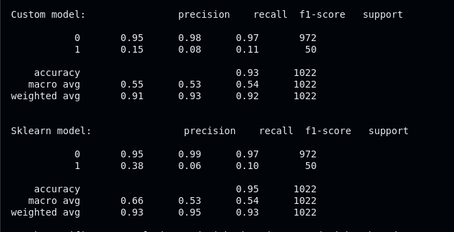
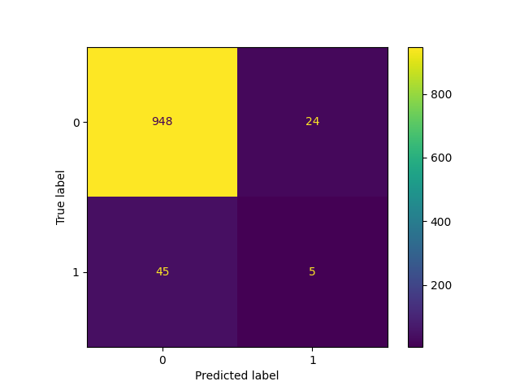
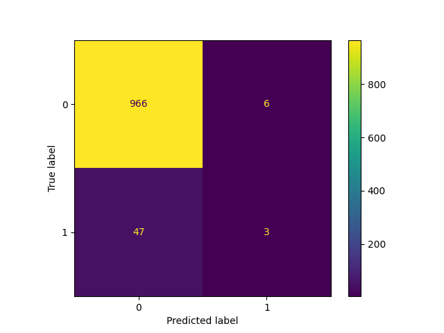
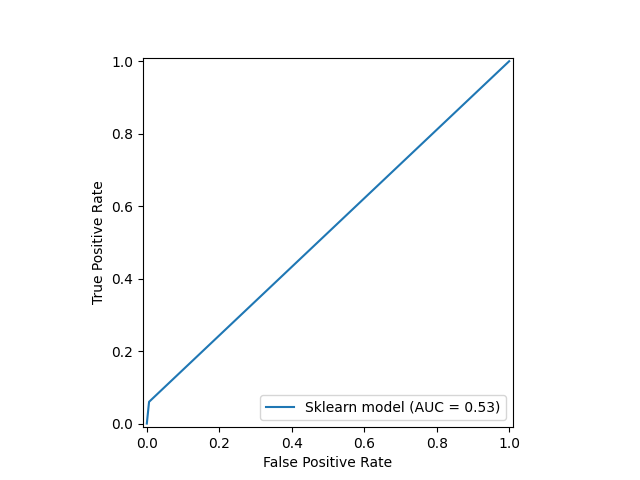
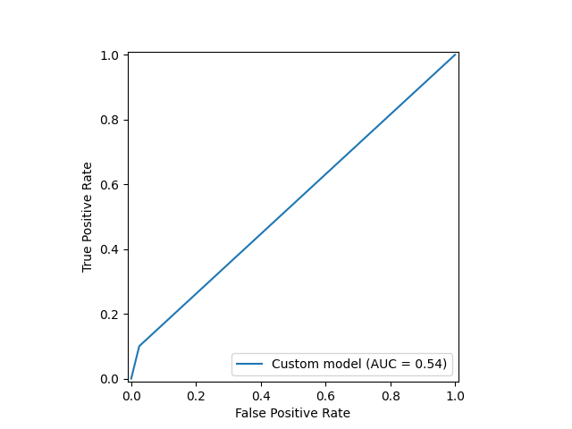

**DATASET**: https://www.kaggle.com/datasets/fedesoriano/stroke-prediction-dataset/data

&nbsp;

# The structure of the dataset
This dataset features a response variable `stroke` which has a binary outcome, 0 or 1. The goal in this project is classify patients that may develop stroke, given a set of features, **X**.
> **id**, type=int, predictor
> 
> **gender**, type=str, predictor variable
> 
> **age**, type=int, predictor variable
>
> **hypertension**, type=int, predictor variable
>
> **heart_disease**, type=int, predictor variable
>
> **ever_married**, type=str, predictor variable
>
> **work_type**, type=str, predictor variable
>
> **residence_type**, type=str, predictor variable
>
> **avg_glucose_level**, type=float, predictor variable
>
> **bmi**, type=float, predictor variable
>
> **smoking_status**, type=str, predictor variable
>
> **stroke**, type=int, **response variable**

&nbsp;

# Data preprocessing
In order to be able to train the model, all features need to be numerical, which you can achieve through **encoding**. There exists many different encoding algorithms, each with their own advantages and downsides. I chose to use **one-hot encoding**, as the number of unique categories for each of the respective categorical features is relatively low. 

Additionally, some of the columns in the dataset contains `NaN` values, in other words missing values. This is quite common in datasets, as some participants may choose to not disclose personal information, or due to other reasons, like `NaN` values having a practical meaning. To address this issue we use the `SimpleImputer()` function from Sklearn, which is configured to replace the missing values with the median of the given feature. To summarize we apply three transformations on the dataset using Sklearn's pipeline object. This object is quite useful, as it allows us to apply a series of transformations to the data in simple sequential manner.

```
cat_features = [1, 5, 6, 7, 10]
num_features = [i for i in range(X.shape[1]) if i not in cat_features]
    
preprocessor = ColumnTransformer([
  ('num', Pipeline([
      ('imputer', SimpleImputer(strategy='median')),
      ('scaler', StandardScaler())
  ]), num_features),
  ('cat', OneHotEncoder(handle_unknown='ignore'), cat_features)
])

X = preprocessor.fit_transform(data)
```

It is usually reasonable to assume a normal distribution of the features, however it may not always be necessary. Standardization typically makes computation easier, but does not apply to every machine learning model. We use the `StandardScaler()` function from Sklearn to standardize a given feature. There is also a large imbalance in the dataset between the number of participants that have developed stroke, and those who have not. This is a problem as it introduces more bias, increasing the model's performance on those who have not developed stroke, but having a neglishing effect on the other end. To solve this issue we introduce the concept of **SMOTE** (from imblearn), which oversamples the minority class, in our example the  patients who have developed stroke (label = 1). Additionally we use a **stratified sampling method** to randomly select patients from both groups, thus reducing the previous heavy imbalance of class distribution.

```
 X_train, X_test, y_train, y_test = train_test_split(X, y, test_size=0.2, random_state=42, stratify=y)
smote = SMOTE(random_state=42)
X_train_resampled, y_train_resampled = smote.fit_resample(X_train, y_train)
```

To train each of the models we again use the pipeline object. This will apply the appropriate preprocessing steps before training the both models. 
```
 c_model = Pipeline([
        ('preprocessor', preprocessor),
        ('classifier', GradientBoost())
    ])

    sk_model = Pipeline([
        ('preprocessor', preprocessor),
        ('classifier', GradientBoostingClassifier())
    ])
```

&nbsp;

# Negative log loss function
This **objective function** is very common in classification algorithms like **Logistic regression** and also in **Gradient boosting**. It is defined in the following way:

$$L(y_i, p_i) = \quad - \left[y_i \log(p_i) + (1 - y_i) \log(1 - p_i)\right]$$

Where $y_i$ is the label of the current sample, and $p_i$ is the predicted label of the current sample and weak learner. We can calculate $p_i$ by using the **Sigmoid function**, $\sigma(y_i)$.

$$p_i = \frac{1}{1 + e^{(-y_i)}}$$

&nbsp;

# The concept of function space
What makes GradientBoosting (and Adaboost for instance) different from other models is that this algorithm works directly with the **function space**, not the analytical expression of the model. Linear regression is an example of a model that uses a analytical expression, in which the goal is to optimize the parameters making up the equation. However GradientBoosting is different, as we are not trying to optimize any parameters, but rather the output of the sequential weak learners. The final weak learner is the weighted sum of all the previously trained weak learners, rather than a single analytical expression. More formally:

$$F_m(x) = F_{m-1}(x) + \gamma_{m} h_{m}(x)$$

As opposed to linear regression

$$F(x) = \beta_0 + \beta_1 x_1 + \dots + \beta_n x_n$$

In the context of machine learning, **function space** is the set of all possible functions that a particular model can learn. For gradient boosting the function space is the set of all possible weighted sums of decision trees (weak learners). The function space is very convenient, as it allows our model to deal with complex non-linear relationships in the data. On the other hand linear regression works in a function space that is more constrained, that is all possible linear equations. **The main takeaway** is that each weak learner in Gradient boosting does not have an analytical form, we are instead working directly with its outputs (predictions).
&nbsp;

# Functional gradient descent
Gradient boosting is also different in how it computes gradients and uses them. Usually when we compute the gradient of a loss function $L(y, p)$, we compute it with respect to the objective function's parameters. An example of this is in linear regression, where we compute the gradient with respect to the betas, $\beta$. However in gradient boosting we compute the gradient with respect to a function, namely the **predict function**, which is defined as $F_m(x_i)$. We call this type of gradient, **functional gradient**. This is interesting, as parameters (a.k.a weights) are typically "fixed", functions on the other hand represent a large range of values (typically an infinite range). 

So how do we derive the gradient in such a case? Looking at the definition of the negative log loss function we have the following:

$$L(y_i, p_i) = \quad - \left[y_i \log(p_i) + (1 - y_i) \log(1 - p_i)\right]$$

$$\frac{\partial L(y, p)}{\partial \hat{y}} = \quad - \left[y_i \cdot \frac{1}{p_i} \cdot \frac{e^{-\hat{y}}}{\left(1 + e^{-\hat{y}}\right)^{2}} \quad - \quad (1 - y) \cdot \frac{\left(1 + e^{-\hat{y}}\right)}{e^{-\hat{y}}} \cdot \frac{e^{-\hat{y}}}{\left(1 + e^{-\hat{y}}\right)^{2}}\right]$$

Simplifying this further, gives us

$$\frac{\partial L(y, p)}{\partial \hat{y}} = \quad - \left[y_i \cdot \frac{e^{-\hat{y}}}{\left(1 + e^{-\hat{y}}\right)} - (1-y) \cdot \frac{1}{\left(1 + e^{-\hat{y}}\right)} \right]$$

Where we have the following:

$$\left(1 - p\right) = \quad \frac{e^{-\hat{y}}}{\left(1 + e^{-\hat{y}}\right)}$$

$$p = \quad \frac{1}{\left(1 + e^{-\hat{y}}\right)}$$

Finally we have...

$$\frac{\partial L(y, p)}{\partial \hat{y}} = \quad - (y - p)$$

This is the gradient that will be used to compute the **pseudo-residuals**.

&nbsp;

# Pseudo residuals
A pseudo-residual is an approximation of the negative gradient of a loss function, with respect to the model's predictions. **The key concept** here is that gradient boosting tries to minimize a loss function iteratively, by computing the pseudo-residual in each iteration and training the next weak learner on the pseudo-residual. In other words, the pseudo-residuals become the target variable for the next weak learner. See the code below.

```
y_pred = 1 / (1+np.exp(-F))
grad = -(y - y_pred) # Pseudo-residual
            
h_m = DecisionTreeRegressor().fit(X, grad)
```
Notice how $h_m$ (which is the $(m+1)^{\text{th}}$ weak learner) is trained on the features matrix, $X$, and the **pesudo-residuals**! This allows us to converge towards a minimum in an iterative manner using weak learners. Note that this differs quite a lot from for example standard linear regression, where we only train one model and minimize the loss function using this **single** model. However, in gradient boosting we minimize the loss function by using the current weak learner, which changes in every iteration. 

&nbsp;

# The step by step process
1. Initialize $F_0(x)$ as the proportion of true positives (strokes) against the total number of samples
```
F = np.full((len(y),), np.log(p/ (1-p))) 
```
2. Train $m$ weak learners by using a for loop
3. Compute the pseudo-residuals

$$r_{i, m} = \quad - \left. \frac{\partial L(y, F(x)}{\partial F(x)} \right\rvert_{F(x)= F\_{m-1}(x)}$$

4. Fit a weak learner closed under scaling $h_m(x)$ to the pseudo-residual. Train the next weak learner using a training set in the form of: $`\{ X, r_m \}`$. Which is described in the code below.
```
h_m = DecisionTreeRegressor().fit(X, grad)
```
>[!NOTE]
> We need to use `DecisionTreeRegressor()` from Sklearn here, as it can work with continuous values in the target variable. This will not work if you try to use `DecisionTreeClassifier()` as this function expects discrete class values (i.e. whole numbers like 0 or 1).

5. Compute the multiplier $\gamma_m$, by solving the following one-dimensional optimization problem:

$$\gamma_m = \text{argmin}_ {\gamma} \sum_{i=1}^{n} L\left[y_i, F_{m-1}(x_i) + \gamma h_m(x_i)\right]$$

We solve this by using the Python library Scipy's `minimize_scalar()` function. This function solves a one-dimensional optimization problem that deals with weights/parameters, which works for our scenario.
The function expects a Python function as argument, which in the given context is the objective function. Thus we supply the negative log loss as the objective function to be minimized.
```
def objective_func(gamma):
    predictions = 1 / (1 + np.exp(-(F + gamma * h_m)))
    epsilon = 1e-10
    predictions = np.clip(predictions, epsilon, 1 - epsilon)
    return -np.sum(y * np.log(predictions) + (1-y) * np.log(1 - predictions))
```
&nbsp;
We perform a clipping to prevent division by zero. The reason is that some predictions may be very small, which can in worst cases lead to arithmetic underflow. 

6. Update the model

$$F_m(x) = F_{m-1}(x) + \gamma_{m} h_m(x)$$

Corresponding to the following line of code.
```
F += gamma * h_m
```
7. Repeat steps (3) to (6) until all weak learners are trained
8. Make predictions by invoking the `predict()` function. This again will call the `predict_proba()` function
9. In the `predict_proba()` function, we multiply each prediction with the corresponding gamma value found in step (5)
```
F = np.zeros(X.shape[0])
for gamma, estimator in zip(self.learning_rate, self.estimators_):
    F += gamma * estimator.predict(X)
```
10. Convert F &mdash; which is expressed as the log odds ratio, a.k.a. logit &mdash; into probabilities using the sigmoid function $\sigma(F(x))$
```
return 1 / (1 + np.exp(-F))
```
11. Use a decision threshold, in our case 0.5, to make class predictions
```
probabilities = self.predict_proba(X)
return np.where(probabilities > 0.5, 1, 0)
```
12. Check model performance using the c-statistic (ROC_AUC score), and for example Sklearn's classification report

&nbsp;

# Results and conclusion

&nbsp;

## Classification report
<div>
    
</div>
The first output belongs to the custom model, and the latter to the Sklearn implementation.

&nbsp;

## Confusion matrix
<div>
 
 
</div>
The image on the left is the CC (confusion matrix) for the custom model, and the image on the right is the CC for the Sklearn implementation.

&nbsp;

## ROC curve
<div>
 
 
</div>
The image on the left is the ROC curve for the custom model, and the image on the right is the ROC curve for the Sklearn implementation.

# Conclusion
From the classification report we can observe high values for precision and recall, which is a good sign for the general performance of the models. However this is not enough evidence to conclude that the models generability is actually good, thus we need to make use of other metrics like the ROC curve. The custom model also has more false negatives than the Sklearn implementation. The c-statistic is at 0.53 for the custom model, and 0.54 for the Sklearn version. This is a **really bad score** in terms of classification, as the model only performs slightly better than random guessing. It should be noted that trying other models will most definitely result in better scores, like for example logistic regression or support vector machines (SVM). The true goal of this project however is to implement the algorithm, which we were successful in doing. 

This project has provided really useful insight into how functional gradients work, and a slight alternation in how you can train weak learners for a final ensemble. I especially find it really intriguing how GradientBoosting is able to minimize the chosen loss function in not a single step, but in multiple iterations! 
