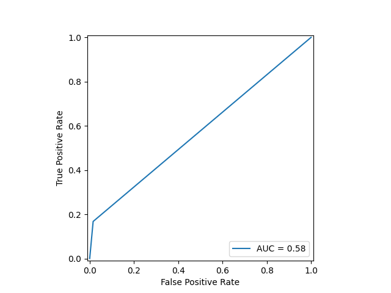

**DATASET FROM** \
https://www.kaggle.com/datasets/vikramamin/bank-loan-approval-lr-dt-rf-and-auc

&nbsp;

# Structure of the dataset
The dataset contains 14 columns, and 5000 samples. Thus the shape of the `data` variable is $\left(5000, 14\right)$. 
> **ID**, type=int64
>
> **Age**, type=int64, predictor variable
>
> **Experience**, type=int64, predictor variable
>
> **Income**, type=int64, predictor variable
>
> **ZIP.Code**, type=int64, predictor variable
>
> **Family**, type=int64, predictor variable
>
> **CCAvg**, type=float64, predictor variable
>
> **Education**, type=int64, predictor variable
>
> **Mortgage**, type=int64, predictor variable
>
> **Personal.Loan**, type=int64, response variable
>
> **Securities.Account**, type=int64, predictor variable
>
> **CD.Account**, type=int64, predictor variable
>
> **Online**, type=int64, predictor variable
>
> **CreditCard**, type=int64, predictor variable

&nbsp;

# Overview
This project focuses on implementing RandomForest and DecisionTree from scratch. RandomForest is considered as one of the best machine learning models for shallow learning, it is also known as a **discriminative** machine learning model.
We make use of this model to predict whether a given person is eligible for a personal loan given the associated features. 

## Random subspacing (feature bagging)
**Feature bagging** is a technique used in ensemble methods like Random Forests to improve the performance and reduce overfitting. This method works in the following way:
1. For each model we ensemble (train), we provide a random subset of features from the full feature set (gotten from the second axis of the training set `X`)
2. A feature can occur more than once in feature bagging, thus introducing extra variance

This method is really useful, because it helps reduce the correlation between individual models Which leads to better generalization against noisy or irrelevant features. We need this due to the fact that training many decision trees can result in very similar results. 

&nbsp;

## Decision Tree
A decision tree is similar to a binary tree in computer sience, but has its own set of rules.
1. Each **internal node** represents a feature from the provided training set
2. Each internal node has an optimal threshould for its feature
3. **Leaf nodes** represent the final predictions

A decision tree has various parameters, such as:
> **max_depth**: the maximum depth of a decision tree
>
> **max_features**: the maximum number of features to be considered when selecting a feature for an internal node
>
> **min_samples_split**: the minimum number of samples required to perform a split


Figure 2 below by Sriram (2020) shows the general structure of a decision tree. Notice how each internal node is a feature, and has some threshold associated with it. For instance "Yes" and "No" are two examples of threshold values in the decision tree example below. On the other hand `Smoker`, `Drinker` and `Weight` would be the features, and the darker blue nodes would be the leaf nodes. \


&nbsp;

### How does it work? 
1. Intialize the root node
2. Recursively populate the tree with the `fit()`and `_build_tree()` functions
3. Check if the constraints are violated: \
:one: The current depth is larger or equal to the maximum depth \
:two: The maximum depth provided to the given node is **None** \
:three: The number of samples provided to the node (by checking the shape of `X`) is smaller than the minimum number of samples for a split to be applied \
:four: The number of labels (from the target array `y`) is equal to 1 
```
    if (self.max_depth is not None and depth >= self.max_depth) or \
           n_samples < self.min_samples_split or \
           n_labels == 1:
            return Node(value=np.argmax(class_counts), class_probs=class_probs)
```
4. For each node, fetch the features provided in the training set `X` using the function `_get_feature_indices`
```
feature_indices = self._get_feature_indices(n_features)
```
6. Find the best feature and threshold that should be set on the given internal node, by using the `_best_split()` function
```
best_feature_index, best_threshold = self._best_split(X, y, feature_indices)

# If no split improves the criterion, create a leaf node
if best_feature_index is None:
    return Node(value=np.argmax(class_counts), class_probs=class_probs)
```
7. To fetch the best feature for the current depth, we use a metric called Gini impurity. Select the feature with the lowest Gini impurity score.

$$I_{G}(p) = \sum_{i=1}^{J} p_{i}(1-p_{i}) \quad \equiv \quad \sum_{i=1}^{J}p_{i} - \sum_{i=1}^{J} p_{i}^{2} \quad \equiv \quad 1 - \sum_{i=1}^{J} p_{i}^{2}$$

Where **J** is the number of classes (2 in our case), and $p_i$ is the probability of a given label for the respective subset of nodes (left or right tree). In code:
```
 def _gini_impurity(self, y):
    _, counts = np.unique(y, return_counts=True)
    probabilities = counts / len(y)
    return 1 - np.sum(probabilities ** 2)
```

8. Once a leaf node is reached, set the `value` parameter of the Node object, and the `class_probs` parameter

&nbsp;

### Making predictions
1. Call the `predict()` function, by providing the testing set denoted by `X`
2. In the predict function, for each sample we invoke the `_tree_traversal()` method
3. The `_tree_traversal()` method moves through the by checking the sample's specific feature up against the threshold and moving accordingly
4. Once we reach the leaf node (indicated by node.value != None), we return the `value` parameter

&nbsp;

## Bootstrap Aggregation
**Bootstrap aggregation**, also known as **bagging**, is a technique used in machine learning to improve the stability and accuracy of models, especially decision trees. Bagging creates multiple subsets of data by randomly sampling with replacement. Thus each decision tree gets its own set of samples &mdash; where duplicates are allowed. This reduces overfitting, since each model captures slightly different patterns reducing the chance capturing noise. Additionally it improves stability, by being less sensitive to oddities in the data which might throw off a single model. Lastly, the ensembled often performs better on new, unseen data than any individual model would. This is equivalent to saying that the model is able to **generalize** better. The code below shows how this technique is implemented.

```
n_samples = X.shape[0]
indices = np.random.choice(n_samples, size=n_samples, replace=True)
X_sample, y_sample = X[indices], y[indices]
```

&nbsp;

## Random Forest
The Random Forest algorithm trains a fixed number of weak learners, typically decision trees. It then uses the weak learners to make predictions or classifications to new samples. Figure 1 below, Gunay (2023), shows a visual representation of a typical random forest. 


This image shows **n** number of decision trees, where $n \in \mathbb{R}$.

&nbsp;

### How does it work?
1. First we call the `fit()` function, this function uses the `joblib` Python library to train decision trees in parallel. Thus making better use of the CPU cores.
2. In the `fit()` function we use a **random state** variable which is for reproduceability
3. Next we determine the maximum number of features to consider in each split, this is used to implement feature bagging. The maximum number of features is calculated in either of the following ways: \
:one: 'sqrt' - compute the square root of the number of features, and then convert it to an int, $\sqrt{13} \approx 4$ \
:two: 'log2' - compute the log base 2 of the number of features, then convert to int, $log_{2}(13) \approx 4$ \
:three: 'None' - set the maximum number of features equal to the number of features (13)
4. Invoke the `_build_tree()` function to train the decision tree by making use of **bootstrap aggregation**

&nbsp;

### Making predictions
1. Invoke the `predict()` function by providing the testing set, `X` as the argument
2. The predict function will call the `predict_proba()` function, which uses a numpy array `tree_probs` (which is a *3D array*)
```
tree_probs = np.array([tree.predict_proba(X) for tree in self.trees])
```
3. The `tree_probs` array has 3 axes,
* The first axis being the decision tree (equal to what is set in `n_estimators` parameter of RandomForest object)
* The second axis is the number of samples (equal to the first axis of `X`), which is 5000
* The third axis is the prediction for each class label, which has a dimension size of 2
4. The `predict_proba()` returns the mean of the probabilities for the class labels, resulting in a shape of $\left(5000, 2\right)$
5. Lastly, the `predict()` function returns the index with the largest number in the second axis. This corresponds to choosing the class label that is most likely for a given sample

&nbsp;

# Results and conclusion
## Classification report
We use Sklearn's classification report function to obtain some insight into how well the model is able to predict true postives, true negatives etc. 
<div>
    
</div>


## Confusion matrix
The first image shows the confusion matrix for the custom RandomForest model. The second image is the result of implementing Sklearn's RandomForestClassifier. As you can see they are quite similar in terms of classification, which is good.
<div>
 
 
</div>

## ROC curve and AUC score
The first image shows the ROC curve and the AUC score in legend for the custom model. The second image is for the Sklearn implementation. From both images we can see that both models perform nearly identical, with an AUC score of 0.58. This score indicates a poor discrimination. The AUC scores measures the model's ability to distinguish between positive and negative classes. In our case the RandomForest classifier has a ~58% probability of ranking a randomly chosen positive sample higher than a randomly chosen negative sample.
<div>
 
 
</div>

&nbsp;

# Conclusion

&nbsp;

# Sources
Figure 1: Gunay, Deniz. "Random Forest". 2023. Medium.
https://medium.com/@denizgunay/random-forest-af5bde5d7e1e. Accessed 19 July 2024.

Figure 2: Sriram. "Decision Tree in Machine Learning Explained [With Examples]". 2020. upGrad.
https://www.upgrad.com/blog/decision-tree-in-machine-learning/. Accessed 19 July 2024.

