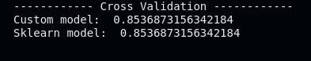
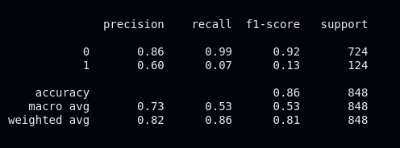
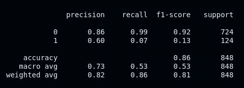
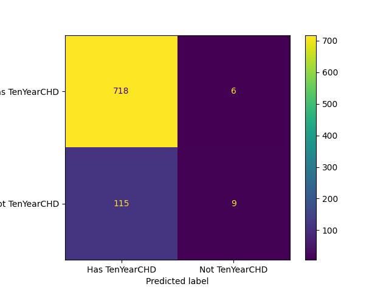
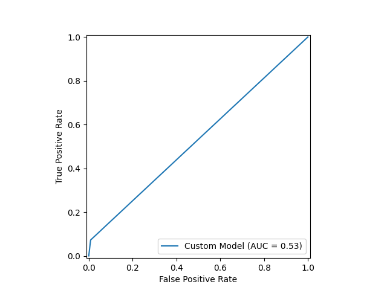

**DATASET FROM**: \
 https://www.kaggle.com/datasets/dileep070/heart-disease-prediction-using-logistic-regression

 # About the dataset
 The dataset has the following columns with a shape of $\left(4238, 16\right)$. They primary objective is to predict whether a patient is likely to developing coronary heart disease (CHD) within the next 10 years, given the provided features. Thus `TenYearCHD` is the response variable.
 > **male**, type=int
 >
 > **age**, type=float
 >
 > **education**, type=int
 >
 > **currentSmoker**, type=int
 >
 > **cigsPerDay**, type=float
 >
 > **BPMeds**, type=int
 >
 > **prevalentStroke**, type=int
 >
 > **prevalentHyp**, type=int
 >
 > **diabetes**, type=int
 >
 > **totChol**, type=float
 >
 > **sysBP**, type=float
 >
 > **diaBP**, type=float
 >
 > **BMI**, type=float
 >
 > **heartRate**, type=float
 >
 > **glucose**, type=float
 >
 > **TenYearCHD**, type=int

&nbsp;

# Shapes of numpy arrays
> **x** (the features of a patient): $\left(4238, 15\right)$ 
> 
> **y** (the targets): $\left(4238,\right)$ 
>
> **y\_pred** (evaluated using sigmoid function $\sigma(z)$ ): $\left(4238,\right)$ 
> 
> **X** (the design matrix): $\left(4238, 16\right)$ 
> 
> **w** (the weights, including the bias term `b`): $\left(16,\right)$ 
> 
> **z** (the logits): $\left(4238,\right)$ 
> 
> **grad** (the gradient vector): $\left(16,\right)$

&nbsp;

# Data preprocessing
The dataset in this project contains some missing values indicated by `NaN`, to resolve this I used the `SimpleImputer` from Sklearn. Essentially, the object is configured to fill any missing `NaN` values with the mean of the respective feature. Thus, since there are missing values in the `glucose` column, we replace the `NaN` values present here with the mean of the `glucose` feature! Additionally, I applied **standardization** on the features, to reduce the number of iterations needed for reaching convergence. See the code below.
```
    imp = SimpleImputer(missing_values=np.nan, strategy='mean')
    x = imp.fit_transform(x)
    # Normalize the features
    x = StandardScaler().fit_transform(x)
```


&nbsp;

# The Basics of Logistic Regression
This type of model is quite similar to **linear regression** in many ways, but deals with classifications as opposed to predicting continuous values. Linear regression uses a linear function to make predictions, while logistic regression uses a S-shaped curve, which is actually the **sigmoid function $\sigma(z)$**. The image by Toprak (2020) illustrates the behaviour of the sigmoid function, see below.


The advantage of using a sigmoid function is that the value range (y-axis) is restricted to 0 and 1. This makes sense intuitively as we cannot have probabilities exceeding 1, and below 0. The steps for this estimator can be seen below.

1. Data preparation, perform normalization on features, split data into training and testing sets respectively
2. Initialize the parameters `w` randomly
3. Define the design matrix, **X**
```
 X = np.column_stack((np.ones((x.shape[0], 1)), x))
```
4. Define the logit function
$$z = \beta_0 + \beta_1x_1 + \dots + \beta_nx_n \quad \equiv X \boldsymbol{\cdot} w$$
5. Define the Sigmoid function $\sigma(z)$
$$\sigma(z) = \frac{1}{1+e^{-z}}$$
6. Forward propagation, compute z and apply the Sigmoid function to obtain `y_pred`
7. Compute the gradient of the negative log-likelihood function (needed for **minimization**)
$$L(w) = - \sum_{n=1}^{n} y^{(i)} \thinspace log \thinspace \left[\sigma\left(z^{(i)}\right)\right] + (1-y^{(i)}) \thinspace log \thinspace \left[1-\sigma\left(z^{(i)}\right)\right]$$
In matrix form...
$$L(w) = - \left[y \thinspace log \thinspace \left(\sigma(z)\right) + (1-y) \thinspace log \thinspace \left(1 - \sigma(z)\right)\right]$$
Where y and z are matrices.
8. Compute the gradient of the loss function $L(w)$ with respect to $w$.
$$\frac{\partial L(w)}{\partial w_j} = \nabla w = X^{T} \boldsymbol{\cdot} \left( y - \sigma(z)\right)$$
In code:
```
 grad = np.dot(X.T, (y - y_pred))
```
9. Update the weight vector, adjust the hyperparameter $\alpha$ for learning rate as needed (e.g. using GridSearch)
```
self.w = self.w + self.learning_rate * grad
```
10. Repeat steps 6 - 9 until convergence (indicated by a gradient smaller than tolerance level, `tol`), or until maximum number of iterations `max_iter` is reached
11. Make predictions and compute model metrics (like e.g. score)

&nbsp;

# Results from testing model
To test the model, I chose the following functions from Sklearn's metrics class.
> `cross_val_score` - computes the estimated model performance of the training set, using `k` folds (where k is set to 10)
>
> `classification_report` - provides a text report showing the main classification metrics &mdash; **precision**, **recall**, **F1-score**, and **support** (number of occurences of each class in the true data)
> 
> `confusion_matrix` - computes a matrix where each row corresponds to the instances in the actual class, while each column represents the instances in the predicted class
>
> `roc_curve` - computes the ROC curve, which plots the **True Positive Rate** (TPR) up against the **False Positive Rate** (FPR) at various tresholds, helps selecting a suitable treshold (used in the `predict()` function)
>
> `auc` - calculates the AUC (Area Under the Curve). Represents the degree/measure of separability between classes, e.g. an AUC score of 0.5 represents a model no better than random guessing

## Cross validation
The image below shows the estimated model performance of both implementations.


## Classification report 
The image to the **left** represents the report for the custom model, and the image to the **right** in the result of applying Sklearn's model to the dataset.

<div>
 
 
</div>

## Confusion matrix
The image to the **left** highlights the performance of the custom model, and the image on the **right** is the performance of Sklearn's logistic regression model. The "y-axis" represents the true labels, and the "x-axis" represents the predicted labels respectively.
<div>
 
 
</div>

## ROC curve and AUC score
The image on the **left** displays the ROC curve and AUC score (in legend) of the custom model. As you have probably guessed, the image on the **right** is the results of the Sklearn implementation of the logistic regression model.
<div>
 
 
</div>

&nbsp;

# Sources
Toprak, M (2020). Activation Functions for Deep Learning [Image]. https://medium.com/@toprak.mhmt/activation-functions-for-deep-learning-13d8b9b20e
