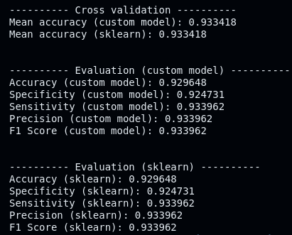
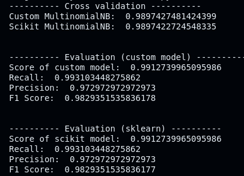
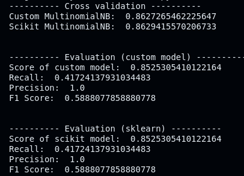
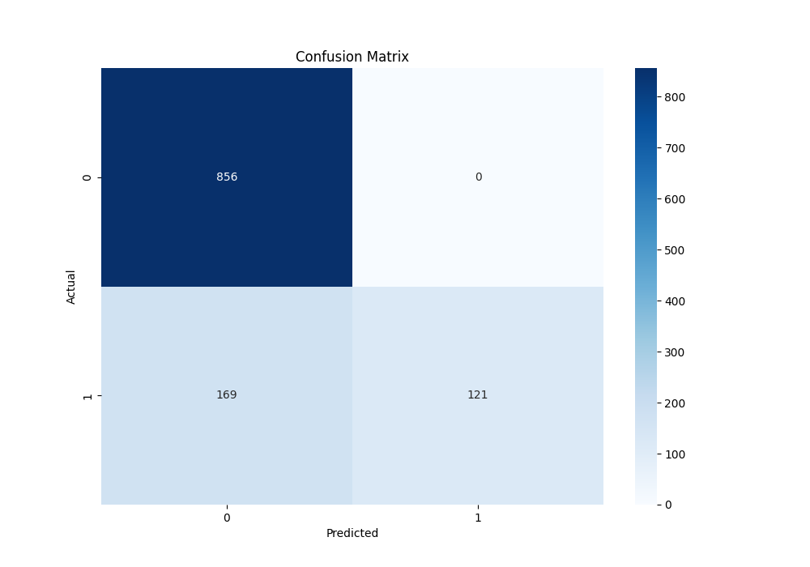

**DATASET FROM:** \
https://www.kaggle.com/datasets/himanshunakrani/naive-bayes-classification-data (Univariate Gaussian Naive Bayes) \
https://www.kaggle.com/datasets/karthickveerakumar/spam-filter/data (Multinomial Naive Bayes)

&nbsp;

# About the datasets
The datasets we will be working with in this project is "diabetes.csv" and "emails.csv". We will be using the Gaussian Naive Bayes for classifying pasients with diabetes, and those without. The latter (Multinomial Naive Bayes) will be used to classify whether a email should be considered spam or "ham" (not being spam). 

## Dataset 1: "Diabetes.csv"
Represented by a Dataframe object / or Numpy array of shape $\left(995, 3\right)$.
> glucose: int
> 
> bloodpressure: int
> 
> diabetes: int

Where `glucose` and `bloodpressure` are the predictors in the dataset, and `diabetes` being the response variable. 

## Dataset 2: "emails.csv"
Represented by a Dataframe object / or Numpy array of shape $\left(5728, 2\right)$
> text: str
> 
> spam: int

Where the `text` variable is the predictor in the form of sentences (str), and `spam` being the response variable.

&nbsp;

# The fundementals of Naive Bayes
The "naive" assumption about this algorithm is that we assume all independent variables to be mutually independent. The reason being that computation becomes much easier, and the algorithm still performs well in most real-life cases, especially for document classification and spam filtering. The downside being that the algorithm may not truly capture the patterns in data, as features may be dependent. In simple terms this how the algorithm works.

1. Gather data
2. Calculate the prior probabilities, $P(C_{k})$
3. Calculate the likelihoods of the class $C_k$ given the features $x_i$
$$P(C_{k} | x_{i}) = \frac{P(C_k) \cdot P(x_{i} | C_{k})}{P(x_{i})}$$
4. Classify the new point by the label with the greatest likelihood 

## EXAMPLE of Gaussian NB: Potato/carrot farm
Assume we have a dataset representing a farm with carrots and potatoes. From the first step (gathering data), we have the following. \
**Features**
> color: orange/brown
>
> shape: long/round
>
> texture: smooth / rough

**Data**
> 100 vegetables, 60 of which are carrots, and 40 are potatoes
> 58 carrots are orange, 55 are long, and 50 are smooth
> 38 potatoes are brown, 35 are round, and 30 are rough

### Step 2: Calculating the prior probabilities
$P(\text{carrot}) = \frac{60}{100} = 0.6$ \
$P(\text{potato}) = \frac{40}{100} = 0.4$

### Step 3: Calculate the likelihoods
Likelihoods for features $x_i$ given the class $C_k$ \

**For carrots** \
$P(\text{orange} | \text{carrot}) = \frac{58}{60} \approx 0.967$ \
$P(\text{long} | \text{carrot}) = \frac{55}{60} \approx 0.917$ \
$P(\text{smooth} | \text{carrot}) = \frac{50}{60} \approx 0.833$

&nbsp;

**For potatoes** \
$P(\text{brown} | \text{potato}) = \frac{38}{40} = 0.95$ \
$P(\text{round} | \text{potato}) = \frac{35}{40} = 0.967$ \
$P(\text{rough} | \text{potato}) = \frac{30}{40} = 0.967$ 

Now we calculate the likelihoods of a class $C_k$ given the features $x_i$. \
$$P(C_{\text{carrot}} | x_{i}) = P(\text{carrot}) \cdot P(\text{orange} | \text{carrot}) \cdot P(\text{long} | \text{carrot}) \cdot P(\text{smooth} | \text{carrot}) \approx 0.0889$$
$$P(C_{\text{potato}} | x_{i}) = P(\text{potato}) \cdot P(\text{brown} | \text{potato}) \cdot P(\text{round} | \text{potato}) \cdot P(\text{rough} | \text{potato}) \approx 0.001875$$ 

>[!NOTE]
>We can compute the likelihood this way because of the naive assumption, thus:
>$$P(A \cap B) = P(A) \cdot P(B)$$
>
>$$P(C_{k} | x_{i}) = P(C_{k}) \cdot P(x_{1} | C_{k}) \cdot P(x_{2} | C_{k}) \cdot \quad \dots \quad \cdot P(x_{n} | C_{k})$$

### Step 4: Make a decision
Since $P(C_{\text{carrot}} | x_{i}) > P(C_{\text{potato}} | x_{i})$, we classify the new vegetable as a carrot.

&nbsp;

# Additional concepts
To make the Naive Bayes algorithm more robust in cases of rare events, and small probabilities we make use of two important concepts.

## Laplace smoothing, $\alpha$
This technique is used to prevent rare events from having a 0 percent chance of occuring. Essentially you add a small value $\alpha$ (which is a **hyperparameter**) to the prior probability $P(C_{k})$. The equation is given by:
$$p_{i, \alpha-smoothed} = \frac{x_i + \alpha}{N + \alpha d}$$

## Log probability
Due to some events having a low probability, we introduce the concept of working in log space. This can be seen in the `log_proba(...)` and `gaussian_log_probability(...)`function. \
The reason we use logs is simply to prevent **arithmetic underflow** of probabilities. 

&nbsp;

# Metrics used 
> **Recall** (specificity): the proportion of True Negatives correctly classified by the algorithm
> $$\frac{tn}{tn + fp}$$
>
> **Sensitivity**: the proportion of True Positives correctly classified by the algorithm
> $$\frac{tp}{tp + fn}$$
>
> **Precision**: the proportion of actual positives correctly classified by the algorithm
> $$\frac{tp}{tp + fp}$$
>
> **F1 Score**: representing both precision and recall
> $$\frac{\text{precision} \cdot \text{recall}}{\text{precision} + \text{recall}}$$

&nbsp;

# The difference between Gaussian and Multinomial Naive Bayes
The main difference lies in how we decide which category a given data point should belong to. In **Gaussian Naive Bayes** we use a Gaussian probability density function given by:
$$f(x) = \frac{1}{\sigma\sqrt{2\pi}}e^{-\frac{1}{2}\left(\frac{x - \mu}{\sigma}\right)^{2}}$$

On the other hand, **Multinomial Naive Bayes** does not use this type of function, instead we compute likelihoods by using feature occurence counts or frequencies:

$$log \thinspace P(C_{k} | x) \propto log \left(P(C_k)\prod_{i=1}^{n} (p_{k,i})^{x_i}\right)$$

$$\therefore log \thinspace P(C_k) + \sum_{i=1}^{n} x_i \cdot log \thinspace p_{k,i}$$

$$\therefore b + w^{T}_{k}x$$

Where we have the following.
> b: $log \thinspace P(C_k)$
>
> $w_{k,i} = log \thinspace p_{k,i}$

$p_{k,i}$ is the probability of a feature $x_i$ given a class $C_k$ (denoted by `i` and `k` respectively). In other words:
$$p_{k,i} = P(x_{i} | C_{k})$$

&nbsp;

Another big difference is how the `fit(...)` function is constructed. In **Gaussian Naive Bayes** we compute the mean $\mu$ and variance $\sigma^{2}$ for each feature $x_i$ given some class $C_k$. While in **Multinomial Naive Bayes** we compute the number of samples in a given class `self.class_count_`, and the word count for the given class `self.word_count_`. These are necessary when computing the respective likelihoods. Both approaches compute the prior probabilities, either in the log or normal form. 

&nbsp;

Lastly, the use cases for these two approaches are slightly different. **Gaussian Naive Bayes** is typically used for regression or classification problems with continuous features, while **Multinomial Naive Bayes** is used in text classification and document categorization. 

# Results from testing models
Results from running Gaussian Naive Bayes on the `diabetes.csv` dataset. \

Multinomial Naive Bayes using `CountVectorizer` on the `text` column in the dataset. \

Multinomial Naive Bayes using `TfidVectorizer()` on the `text` column in the dataset. \

Corresponding confusion matrix to this implementation.

