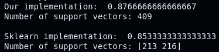
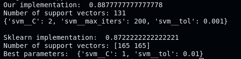
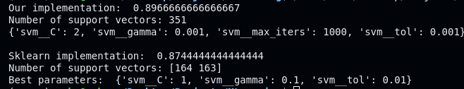

**DATASET FROM**: https://www.kaggle.com/datasets/muratkokludataset/raisin-dataset?resource=download

&nbsp;

This project is rather unique, as it involves implementing both the estimator, but also a form of quadratic programming solver.
Support Vector Machines are estimators, or rather models that aim to classify new data points into either of two groups. Our dataset covers raisins grown in Turkey, and the goal is to predict whether a new raisin is of type "Kecimen" or "Besni".

&nbsp;

# Structure of the raisin dataset
The shape of the dataset is (900, 8). Meaning a sample axis of 900 dimensions, and a features axis of 8 dimensions. There are the following features:

> **Area** , type=float
> 
> **MajorAxisLength**, type=float
> 
> **MinorAxisLength**, type=float
> 
> **Eccentricity**, type=float
> 
> **ConvexArea**, type=float
> 
> **Extent**, type=float
> 
> **Perimeter**, type=float
> 
> **Class**, type=string 

Thus there are in total 7 quantitative variables (only continuous), and 1 categorical variable (being the response variable).

&nbsp;

# Feature engineering
To prepare for training the model, we must first do some data preprocessing. I use the Pandas library to store all the data (from the Excel file) to a DataFrame object, which again is converted into a Numpy array.
Additionally I assume the data is normally distributed, thus we perform standardization on the features inside the Pipeline object. Lastly we must set the target values to -1 or 1, see below.
```
 data_excel = pd.read_excel("dataset/raisin.xlsx")
    data = data_excel.to_numpy()
    data[data == 'Kecimen'] = 1
    data[data == 'Besni'] = -1
```
The pipeline object is given by:
```
Pipeline([
    ('scaling', StandardScaler()),
    ('svm', SVM())
])
```

&nbsp;

# Introduction to SVM, and what to solve
Support Vector Machine (SVM) is a type of algorithm that aims to classify new points by using a **decision boundary**. In simple terms, a decision boundary is a N-1 dimensional object (a hyperplane in mathematical terms) which existence is to cleanly separate data into two groups in some N-space. A SVM can be implemented in two ways, using a **Hard Margin Classifier** and a **Soft Margin Classifier**. 

The former (Hard Margin Classifier) requires that the data is **linearly separable**, i.e. that you can separate the data without any of the two groups touching each other. This approach is typically not possible to implement in practice, as there is often noise in data leading to messy patterns. The latter (Soft Margin Classifier) is an approach that is suitable in a real-world environment as it allows for misclassifications which is the core problem of machine learning (bias-variance tradeoff). The image below by Singh (2023) illustrates the difference between these two implementations of SVM graphically.


&nbsp;

**How exactly is the data separated?** \
By maximizing the distance between **support vectors** and the **decision boundary**. A support vector is a data point (or individual) which either lies on or within the margin boundaries. These are the data points that matter the most when optimizing the decision boundary. The Hard Margin Classifier focuses only on maximizing distance, while the Soft Margin Classifier focuses on both maximizing the margin, **but also** minimizing the misclassifications through a **hyperparameter** called the **regularization** parameter `C`. A hyperparameter is a parameter that is not learned by the model, but has to be set manually by a human (more on this later). From the image we have the following equations:

$(1)\quad \vec{w} \cdot \vec{x} + b = 1$

$(2)\quad \vec{w} \cdot \vec{x} + b = 0$

$(3)\quad \vec{w} \cdot \vec{x} + b = -1$

Therefore the main goal is to find the weight vector **w** and the bias term **b**. We can find these variables by solving the primal problem for soft margin SVM given by: \
$$min_{w \hspace{0.05cm},b \hspace{0.05cm},\xi}\hspace{0.1cm} \|| w^{2} \|| + C \sum_{i=1}^n \xi$$ 
$$s.t. \quad y_{i}\left(w^{T}x_{i} + b\right) \geq 1 - \xi_{i} \quad \forall i = 1, \dots, n$$

From the equation we have the following: 

$y_{i}\left(w^{T}x_{i} + b\right)$ is the decision function, used to compute the distance between each point and the hyperplane (Support Vector Classifier) 

$w$ is the weight vector, it represents all the weights of the hyperplane 

Sum of all the penalties $\xi_{i}$ given by:
$$\sum_{i=1}^n \xi = \xi_{1} + \xi_{2} + \dots + \xi_{n}$$

&nbsp;

## Defining the meaning of penalty
The penalty, $\xi$, in the context of SVM is used to handle misclassifications, and points that fall within the margin. Each penalty is calculated by using the **hinge loss function**:

$$\ell(x) = max(0, 1 - y_{i}\left(w \cdot x - b \right))$$

There are 3 possible cases that can occur when deciding on the penalty of a point.

&nbsp;

🟧 **Case 1: Correctly classified and outside the margin**
If $y_{i}\left(w \cdot x - b \right) > 1$, the output of the classification function is outside the boundary of the margin

&nbsp;

🟪 **Case 2: On the margin or misclassified**
If $y_{i}\left(w \cdot x - b \right) < 1$, either the point is on the wrong side of the margin but correctly classified (between the decision boundary and the margin), or the point is misclassified

&nbsp;

🟥 **Case 3: Exactly on the decision boundary**
If $y_{i}\left(w \cdot x - b \right) = 0$ the point lies exactly on the decision boundary.

&nbsp;

## The Dual Problem and the Kernel Trick
In optimization theory, there exists a corresponding problem to the primal problem known as the **dual problem**. Solving the dual problem can offer different computational or theoretical advantages, and in some cases, it might be less computationally intensive. A part of our implementation focuses on the dual problem because it allows us to employ the kernel trick. This approach is particularly beneficial in scenarios like support vector machines, where it enables the handling of high-dimensional feature spaces more efficiently. The dual problem for primal problem specified above is given as:

$$max_{\alpha} \hspace{0.1cm} \sum_{i=1}^{n} \alpha_i - \frac{1}{2}\sum_{i=1}^n\sum_{j=1}^{n}\alpha_{i}\alpha_{j}y_{i}y_{j}\left(x_{i} \boldsymbol\cdot x_{j}\right)$$

$$\text{subject to} \quad 0 \leq \alpha_{i} \leq C \quad \forall i \quad \text{and} \quad \sum_{i=1}^{n} \alpha_{i}y_{i} = 0$$

The interesting part about this equation is the **dot product** between $x_i$ and $x_j$, since we can replace this with a kernel matrix, called the **Gram matrix**.

$$G_{ij} = \langle x_{i}, x_{j} \rangle$$

In essence, the Gram matrix stores the dot products between every pair of $x_i$ and $x_j$. This allows for using the kernel trick, since we do not perform the operation to move the points to a higher dimensional space, we only compute the transformed dot products. The code below illustrates one of the kernel functions that is implemented in the SMO class. 
```
def polynomial_kernel(X, Y=None, r=0, d=3, gamma=None):
    if Y is None:
        Y = X
        
    K = np.dot(X, Y.T)
    if gamma is None:
        gamma = 1 / (X.shape[1]*np.var(X))
    
    return (gamma * K + r)**d
``` 

&nbsp;

# Sequential Minimal Optimization (SMO)
Is an algorithm that solves the quadratic programming (QP) problem that arises during training in SVM. I noticed that this approach is not as efficient as the QP-solver Sklearn uses on this dataset, thus it is a bit slower in training the model. I chose to create a separate class for the SMO, since it made it more convenient to handle the large amount of code. To start of, the main function of this class is `sequential_minimal_optimization(...)`, and it is invoked by the `fit(...)` method in the SVM class.

This function uses hyperparameters to find the alphas $\alpha_i$. Lets cover them.
> **max_iters** - the number of iterations for updating the $\alpha_i$
>
> **tol** - a tolerance level, used to determine when the optimization algorithm should stop iterating  (thus finding a optimal solution)
>
> **C** - the regularization parameter, controls the trade-off between achieving a low error on the training data and minimizing the model complexity for better generalization

Other useful variables used are:
> **kernel_cache** - used to store the kernel matrix, `K`, returned by the chosen kernel function. It <ins>significantly improves performance</ins>, due to less computation!
>
> **errors** - represents the residuals calculated as the difference between the predicted scores and the actual labels $y_i \in \lbrace -1,1 \rbrace$

&nbsp;

## Compilation steps in the SMO algorithm
For each iteration we pick a $\alpha_i$, and check if violates the **Karush-Kuhn-Tucker (KKT)** conditions. Which are first derivative tests for a solution in non-linear programming to be optimal. This theorem is also known as **saddle-point theorem**. We have the following.

&nbsp;

### 1. Finding alphas, $\alpha$ that violate KKT-conditions
🟢 $y_i = -1 \quad \Rightarrow \quad y_i \cdot E_i < -tol \quad \text{and} \quad \alpha_{i} < C$ \
🔵 $y_i = 1 \quad \Rightarrow \quad y_i \cdot E_i > tol \quad \text{and} \quad \alpha_{i} > 0$ 

This checks the following conditions:

&nbsp;

➡️ **Primal feasibility** \
The requirement in context of SVM means that all data points must be on or outside the margin boundary according to their class labels. For any data point $x_i$ with label $y_i$ the condition is: \
$$y_{i} \cdot \left(\text{decision function}\right) \geq 1$$

Thus if $y_i = 1$ the point should be on or above the boundary, and if $y_i = -1$ the point show be on or below the boundary.

&nbsp;

➡️ **Dual feasibility** \
Relates to the constraints on the Lagrange multipliers $\alpha_i$. Each $\alpha_i$ corresponds to a training example $x_i$. These coefficients are used to optimize the margin width.

* Each $\alpha_i$ must be non-negative
* Each $\alpha_i$ must not exceed the upper bound **C** (the regularization parameter)

&nbsp;

➡️ **Complementary slackness** \
This property ensures that the Lagrange multipliers are used efficiently. It states the following:

* If $\alpha_i > 0$, then the corresponding data point $x_i$ lies exactly on the margin boundary, thus $x_i$ is a **support vector**
* If $\alpha_i = 0$, the data point $x_i$ is either correctly classified beyond the margin, or potentially misclassified or within the margin (in the case of Soft Margin SVM)

>[!TIP]
>Why do we multiply the label $y_i$ with the error $E_i$? The reason for this is to determine the margin violation for each data point. It tells us how much the prediction deviates from the expected result. Thus if the <ins>product is negative</ins>, it means the data point $x_i$ is on the wrong side of the margin (i.e. misclassified). If the <ins>product is positive</ins>, it is either correctly classified and outside of the SVM margin (indicated by a large value), or small and thus close to the margin boundary.

&nbsp;

### 2. Choose the second alpha, $\alpha_j$
We choose a random $\alpha_j$ to ensure that the SMO algorithm efficiently explores the solution space. Random selection prevents the algorithm from getting stuck in a loop, or converging too quickly on a suboptimal solution. A **suboptimal** solution is a solution that is not the best possible outcome, it is inferior to the optimal solution. A **optimal solution** being a solution that perfectly meets all criteria for the best result.
```
j = np.random.randint(low=0, high=n-1)
```

&nbsp;

### 3. Updating the alphas $\alpha_i$ and $\alpha_j$
This part is covered in the `update_multipliers(...)` function.

First we calculate the bounds (L, H) for $\alpha_j$. These bounds are determined by the SVM constraints which ensures that the alphas stay within a $\left[0, C\right]$ interval.
```
if y_i != y_j:
        L = max(0, alpha_j_old - alpha_i_old)
        H = min(C, C + alpha_j_old - alpha_i_old)
    else:
        L = max(0, alpha_j_old + alpha_i_old - C)
        H = min(C, alpha_j_old + alpha_i_old)
```
Furthermore we calculate the variable $\eta$ (eta), which is a measure of the second derivative of the objective function regarding $\alpha_j$, and determines how much $\alpha_j$ should be adjusted. If $\eta$ is non-negative, no optimization is performed because the objective function is not reduced in the direction between `i` and `j`. 
```
eta = 2 * kernel_cache[i, j] - kernel_cache[i, i] - kernel_cache[j, j]
    if eta >= 0:
        return False, b
```
Next we update $\alpha_j$, which is based on $\eta$, and the difference in errors $E_i$ and $E_j$. To ensure the new $\alpha_j$ value satisfies the constraints, we clip it to the bounds $\left(L, H\right)$.
```
alphas[j] -= y_j * (E_i - E_j) / eta
alphas[j] = max(L, min(H, alphas[j]))
```
Like with $\alpha_j$, we must update $\alpha_i$ by considering the change in $\alpha_j$. This must be done while ensuring that the sum of the product of the labels, and their respective alphas remain constant. See the condition below.
$$\sum_{i=1}^{n} \alpha_{i}y_{i} = 0$$
Implemented in code: 
```
alphas[i] += y_i * y_j * (alpha_j_old - alphas[j])
```

Lastly we update the bias term `b` based on the changes in $\alpha_i$ and $\alpha_j$. The reason we use these conditions is to ensure that we obtain a value for `b` when either of the Lagrange multipliers are within the margin ($0 < \alpha_i < C$). See the code below.
```
 if 0 < alphas[i] < C:
        b = b1
    elif 0 < alphas[j] < C:
        b = b2
    else:
        b = (b1 + b2) / 2
```

&nbsp;

# Testing SVM model
By using the **SMO** algorithm we can fetch the alphas $\alpha$, and the bias term `b` to make predictions about new data points. The decision function is used to compute the score for each individual data point in testing set. In simple terms it calculates the distance between the point and the decision boundary, and the `predict(...)` function classifies these distances as either a -1 or +1. The `predict(...)` function is necessary, due to the target values being in the form of ±1. See the code below.
```
def decision_function(self, X):        
    kernel_func = smo.rbf_kernel
    K = kernel_func(X, self.support_vectors)

    return (np.dot(self.alphas*self.labels, K.T) + self.b)
```
```    
def predict(self, test_data):
    return np.sign(self.decision_function(test_data))
```
> [!NOTE]
> In this sample code we use the Radial Basis Kernel function (indicated by `smo.rbf_kernel`), but you can change this to `polynomial_kernel` or `linear_kernel` if needed

The metric I chose to use to determine the model's performance, is the accuracy metric. It is important to note that there exists many other metrics that may be just as suitable, like for example **specificity** or **sensitivity**.
```
def accuracy(self, test_data, labels):
    return np.mean(self.predict(test_data) == labels)
```

## Cross Validation
In this project, we use a powerful method known as **cross validation** to evaluate the true performance of our model. This technique exposes the model to different combinations of training and testing sets. Specifically, I implemented the common 10-fold cross-validation using the `GridSearchCV` class from Sklearn. This approach divides the dataset into ten parts, using one fold for testing and the remaining nine for training in each iteration. This ensures each data point is used in the testing phase exactly once, offering a comprehensive assessment of model performance.
Grid Search

## Grid Search
Regarding **hyperparameters**, which I mentioned earlier, they are typically determined through a combination of experience and systematic techniques like **Grid Search**. `GridSearchCV` in Sklearn facilitates this by accepting a dictionary of parameter values, the pipeline object, and optional settings such as the number of folds, processor cores to use, and scoring method. It tests every possible combination of parameters to find the best ones. Below is an example of how this is implemented:

```
param_grid1 = {
    'svm__max_iters': [1000, 500],
    'svm__tol': [0.01, 0.001],
    'svm__C': [2],
    'svm__gamma': [0.001]
}
```

Here we have a total of combinations of $C = 2 * 2 * 1 * 1 = 4$. Thus we run 4 iterations, trying all possible hyperparameter values. Once all iterations are complete, we can print out the best possible combinations of hyperparameters. See below.
```
 print("Our implementation: ", grid1.best_score_)
```

&nbsp;

# Results from running the model
**Polynomial kernel** \


&nbsp;

**Linear kernel** \


&nbsp;

**Radial Basis Kernel** \


&nbsp;

# Thank you
Thank you for reading this project, I hope it could be to some use. \
~ Gard

&nbsp;

# Sources
Singh, N. (2023). Soft Margin SVM / Support Vector Classifier (SVC) [Graph]. https://pub.aimind.so/soft-margin-svm-exploring-slack-variables-the-c-parameter-and-flexibility-1555f4834ecc
