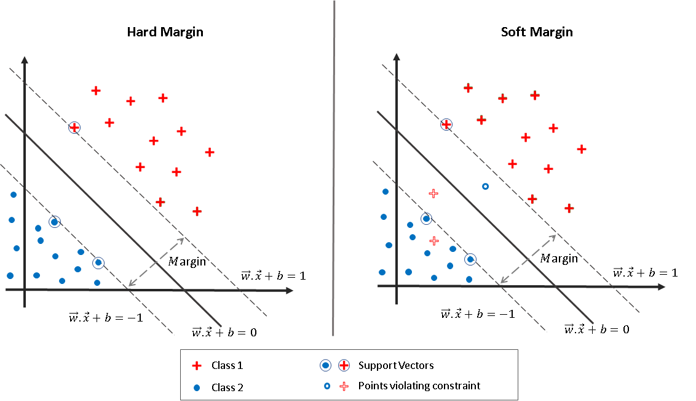

Dataset from: https://www.kaggle.com/datasets/muratkokludataset/raisin-dataset?resource=download

This project is rather unique, as it has involved implementing both the estimator, but also a form of quadratic programming solver.
Support Vector Machines are estimators, or rather models that aim to classify new data points into either of two groups. Our dataset covers raisins grown in Turkey, and the goal is to predict whether a new raisin is of type "Kecimen" or "Besni". Thus we are interested in understanding how well our custom model can classify a raisin as a Kecimen or Besni type. 

# Structure of the raisin dataset
The shape of the dataset is (900, 8). Meaning a sample axis of 900 dimensions, and a features axis with 8 dimensions. There are the following features:

> **Area** , type=float
> 
> **MajorAxisLength**, type=float
> 
> **MinorAxisLength**, type=float
> 
> **Eccentricity**, type=float
> 
> **ConvexArea**, type=float
> 
> **Extent**, type=float
> 
> **Perimeter**, type=float
> 
> **Class**, type=string 

Thus there are in total 7 quantitative variables (only continuous), and 1 categorical variable (being the response variable).

# Introduction to SVM, and what to solve
Support Vector Machine (SVM) is a type of algorithm that aims to classify new points by using a **decision boundary**. In simple terms, a decision boundary is a N-1 dimensional object (a hyperplane in mathematical terms) which existence is to cleanly separate two groups in some N-space. A SVM can be implemented in two ways, using a **Hard Margin Classifier** and a **Soft Margin Classifier**. A the former requires that the data is **linearly separable**, i.e. that you separate the data without any of the two groups touching each other. This approach is typically not possible to implement in practice, as there is often noise in data leading to messy patterns. The latter (Soft Margin Classifier) is an approach that is suitable in a real-world environment as it allows for misclassifications which is a core problem of machine learning (bias-variance tradeoff). The image below by Singh (2023) illustrates the difference between these two implementations of SVM graphically.

So how exactly is the data separated? By maximizing the distance between **support vectors** and the **decision boundary**. A support vector is a data point (or individual) which lies within the margin, or on the margin. These are the data points that matter the most when optimizing the decision boundary. The Hard Margin Classifier focuses only on maximizing distance, while the Soft Margin Classifier focuses on both maximizing the margin, **but also** minimizing the misclassifications through a **hyperparameter** called the **regularization** parameter `C`. A hyperparameter is a parameter that is not learned by the model, but has to be set manually by a human. From the image we have the following equations:

$(1)\quad \vec{w} \cdot \vec{x} + b = 1$

$(2)\quad \vec{w} \cdot \vec{x} + b = 0$

$(3)\quad \vec{w} \cdot \vec{x} + b = -1$

Therefore the main goal is to find the weight vector **w** and the bias term **b**. We can find these variables by solving the primal problem. The margin size is given by: 
$K = \frac{2}{\|\vec{w}\|}$. Thus to maximize `K` we must minimize `w`.  To do so we introduce some constraints.
$y_{i} \cdot \left(\vec{w} \cdot \vec{x_{i}} -b \right) \geq 1$, $\quad$ where $y_{i} \in \lbrace{-1,1 \rbrace}$

# Sources
Singh, N. (2023). Soft Margin SVM / Support Vector Classifier (SVC) [Graph]. https://pub.aimind.so/soft-margin-svm-exploring-slack-variables-the-c-parameter-and-flexibility-1555f4834ecc
